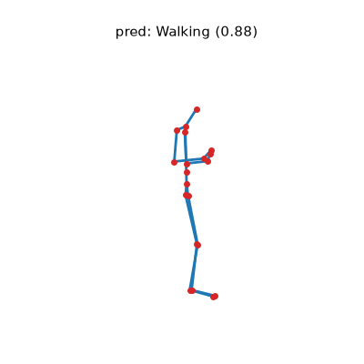
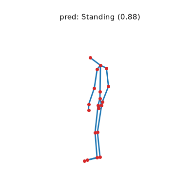
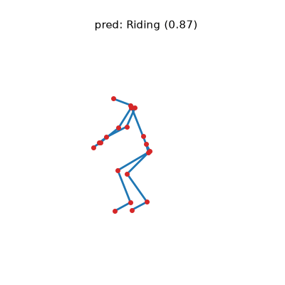
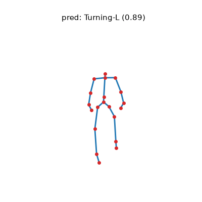
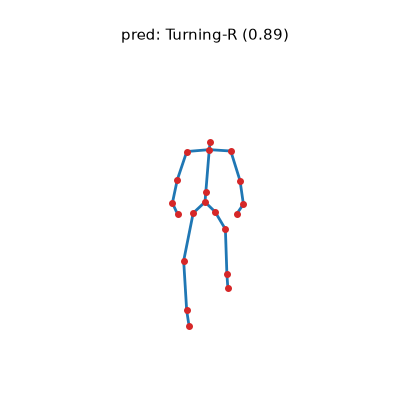

# bikeActions

Skeleton-based action recognition for cyclist / pedestrian traffic scenes. A
[SkateFormer](https://github.com/KAIST-VICLab/SkateFormer) model classifies a
short 3D skeleton sequence into one of five actions:

| id | class     | meaning                     |
|----|-----------|-----------------------------|
| 0  | Walking   | pedestrian walking          |
| 1  | Standing  | standing still              |
| 2  | Riding    | riding a bike               |
| 3  | Turning-L | turning / signalling left   |
| 4  | Turning-R | turning / signalling right  |

The repository is self-contained: it ships the data, the pretrained
checkpoints, a one-command demo, and a training script.

## Data

Each sample is a JSON file under `data/bikeScenes_test/` with:

- `skeletons`: a `(T, 20, 3)` array — `T` frames × 20 joints × 3 coordinates
  `(x, y, z)`, with `y` vertical (increasing downward, camera convention).
- `label`: an integer in a 9-way source taxonomy; only five values map to a
  training class (see `src/bikeact/labels.py`), the rest are excluded.

Train / validation / test splits are listed in `data/splits/{train,validation,test}.txt`.

## Install

Requires [uv](https://docs.astral.sh/uv/). The default install pulls a CUDA 12.4
build of PyTorch (works with NVIDIA driver ≥ 545):

```bash
uv sync
```

CPU-only or a different CUDA version? Edit the `[[tool.uv.index]]` /
`[tool.uv.sources]` block in `pyproject.toml` (e.g. point it at
`https://download.pytorch.org/whl/cpu`) and re-run `uv sync`.

## Demo

Classify a random test sample, print the prediction, and render an animated
skeleton GIF (`demo_output.gif`):

```bash
uv run python demo.py                       # random test sample, bone model
uv run python demo.py --seed 3              # a different random sample
uv run python demo.py --sample data/bikeScenes_test/a01_ID0_0.json
uv run python demo.py --checkpoint checkpoints/skateformer_joint.pt --modality j
```

Output:

```
sample     : h25_ID2_0.json
prediction : Riding  (confidence 0.870)
true label : Riding  [CORRECT]
saved GIF  : demo_output.gif
```

## Examples

One correctly classified sample per class (bone model), rendered by `demo.py`:

| Walking | Standing | Riding | Turning-L | Turning-R |
|---------|----------|--------|-----------|-----------|
|  |  |  |  |  |

## Train

Train from scratch on the bundled splits (writes the best checkpoint and
`metrics.json` to `--out-dir`):

```bash
uv run python train.py --modality b --epochs 100 --out-dir runs/bone
```

Optional Weights & Biases logging — pass a project name to enable it, omit it to
log to the console + `metrics.json` only:

```bash
uv run python train.py --modality b --epochs 100 \
    --wandb-project bikeactions --wandb-name bone-run1
```

## Checkpoints & results

Two pretrained checkpoints ship in `checkpoints/`. Held-out accuracy:

| checkpoint             | modality | val acc | test acc |
|------------------------|----------|---------|----------|
| `skateformer_bone.pt`  | bone     | 0.927   | 0.920    |
| `skateformer_joint.pt` | joint    | 0.486   | 0.504    |

**Use the bone model** (the demo defaults to it) — the bone modality (relative
joint offsets) is far more discriminative here than raw joint positions.

Training from scratch reproduces the bone checkpoint: a fresh
`uv run python train.py --modality b --epochs 100 --seed 1` reaches **0.954 val**
/ **0.920 test**, matching the shipped model.

## Repository layout

```
bikeActions/
├── data/                    # samples (data/bikeScenes_test/) + splits
├── checkpoints/             # pretrained bone + joint models
├── src/bikeact/
│   ├── labels.py            # 5-class scheme + source-label mapping
│   ├── preprocess.py        # skeleton transforms (center/normalize/resample/bone)
│   ├── dataset.py           # split-driven torch Dataset
│   ├── model.py             # vendored SkateFormer
│   ├── infer.py             # model build / load / single-sample predict
│   ├── evaluate.py          # accuracy + per-class metrics
│   └── viz.py               # animated skeleton GIF
├── train.py                 # training entrypoint
└── demo.py                  # demo entrypoint
```

## Development

```bash
uvx ruff check .     # lint
uvx mypy             # type-check (strict)
```

## Annotation tool

The action labels were created with our action annotation tool:
<https://github.com/max-a-ai/action-annotation-ui>

## Attribution

The model is [SkateFormer](https://github.com/KAIST-VICLab/SkateFormer) (Do &
Kim, ECCV 2024), vendored in `src/bikeact/model.py` and kept close to upstream
for checkpoint compatibility. Released under the MIT License (see `LICENSE`).
